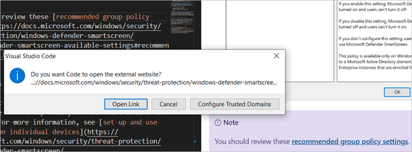

# Microsoft Edge support for Windows Defender SmartScreen

This article describes the benefits of using Windows Defender SmartScreen, explains how it works, and describes how to configure this Microsoft Edge feature.

> [!NOTE]
> This article applies to Microsoft Edge version 77 or later.

Windows Defender SmartScreen is a service that Microsoft Edge uses to keep you safe while you browse the web. Windows Defender SmartScreen provides an early warning system against websites that might engage in phishing attacks or attempt to distribute malware through a focused attack.

> [!NOTE]
> Before Windows 10, version 1703, this feature was called the SmartScreen filter when used within the browser and Windows SmartScreen when used outside of the browser.

## The benefits of Windows Defender SmartScreen

Windows Defender SmartScreen provides several benefits, which are summarized in the following list. These benefits are described in detail in the [Windows Defender SmartScreen documentation](https://docs.microsoft.com/windows/security/threat-protection/windows-defender-smartscreen/windows-defender-smartscreen-overview#benefits-of-windows-defender-smartscreen). The benefits are:

- Anti-phishing and anti-malware support
- Reputation-based URL and app protection
- Operating system integration
- Improved heuristics and diagnostic data
- Management through Group Policy and Microsoft Intune
- Blocking URLs associated with potentially unwanted applications

## Understand how Windows Defender SmartScreen works

 Windows Defender SmartScreen analyzes webpages for suspicious behavior and checks visited sites against an online list of reported phishing, malware, exploit, and scam sites. Windows Defender SmartScreen also checks downloaded apps or app installers to see if they're malicious. In both scenarios, Windows Defender SmartScreen warns users about a suspicious site.

### Site analysis

Windows Defender SmartScreen determines whether a site is potentially malicious by:

- Analyzing visited webpages looking for indications of suspicious behavior. If Windows Defender SmartScreen determines that a page is suspicious, it will show a warning page to advise caution.
- Checking the visited sites against a dynamic list of reported phishing sites and malicious software sites. If it finds a match, Windows Defender SmartScreen shows a warning to let the user know that the site might be malicious.

### File analysis

Windows Defender SmartScreen determines whether a downloaded app or app installer is potentially malicious by:

- Checking downloaded files against a list of reported malicious software sites and programs known to be unsafe. If it finds a match, Windows Defender SmartScreen shows a warning to let the user know that the site might be malicious.
- Checking downloaded files against a dynamic list of files that are well known and downloaded by many Windows users. If the file isn't on that list, Windows Defender SmartScreen shows a warning, advising caution.

The next screenshot shows an example of a Windows Defender SmartScreen warning message when a user tries to open an external web site.

Users are giving the option of reporting a blocked site as safe or unsafe from within the warning message. For more information, see [how to report a site](https://docs.microsoft.com/windows/security/threat-protection/windows-defender-smartscreen/windows-defender-smartscreen-set-individual-device#how-users-can-report-websites-as-safe-or-unsafe).

> [!CAUTION]
> By default, Windows Defender SmartScreen lets users bypass warnings. Because this user interaction is potentially risky, we recommend that you review these [recommended group policy settings](https://docs.microsoft.com/windows/security/threat-protection/windows-defender-smartscreen/windows-defender-smartscreen-available-settings#recommended-group-policy-and-mdm-settings-for-your-organization).

## Windows Defender SmartScreen and user privacy

Windows Defender SmartScreen keeps users safe while they browse the internet by using a reputation check system. Microsoft Edge passes relevant information about the URL or file to the Windows Defender SmartScreen service to start the reputation check. The check compares the website or file against dynamic lists of sites and files that are known to be dangerous. All requests to the Windows Defender SmartScreen service are made with TLS encryption. The service returns the results of the reputation check, which might lead to Microsoft Edge blocking the site or file. These results are stored locally on the device.

The Windows Defender SmartScreen service stores data about the reputation checks and builds a database of known malicious URLs and files. This data is stored on secure Microsoft servers and is only used for Microsoft security services. This data will never be used to identify or target users in any way. Clearing browsing cache clears all locally stored Windows Defender SmartScreen URL data. Clearing download history will remove any locally stored SmartScreen data about file downloads.

For more information about Windows Defender SmartScreen and privacy, read the [Microsoft Edge Privacy Whitepaper](https://docs.microsoft.com/microsoft-edge/privacy-whitepaper#smartscreen).

## Windows Defender SmartScreen setup for admins

Admins can set up Windows Defender SmartScreen using Group Policy, Microsoft Intune, and mobile device management (MDM) settings. Based on how you set up Windows Defender SmartScreen, you can show users a warning page and let them continue to the site, or block the site entirely.

### Windows Defender SmartScreen set up using Group Policy

For a complete list of SmartScreen policies, see
[Windows Defender SmartScreen settings](https://docs.microsoft.com/DeployEdge/microsoft-edge-policies#smartscreen-settings)

### Windows Defender SmartScreen set up using Microsoft Intune or MDM

For more information, see:

- [Windows Intune settings for Windows Defender SmartSceen](https://docs.microsoft.com/mem/intune/protect/endpoint-protection-windows-10#windows-defender-smartscreen-settings)
- [MDM policy settings](https://docs.microsoft.com/mem/intune/protect/endpoint-protection-windows-10#windows-defender-smartscreen-settings)

## Windows Defender SmartScreen setup for users

Windows Defender SmartScreen is turned on by default for Microsoft Edge. To turn off Windows Defender SmartScreen, go to *edge://settings/privacy > Services > Microsoft Defender SmartScreen*. This setting is the same for all profiles associated with the installation of Microsoft Edge on a device. This setting is not synced across devices. The setting applies to InPrivate browsing and Guest mode. If a device is managed with group policies set by an organization, this configuration will be reflected in *edge://settings/privacy*.

> [!NOTE]
> Users can set up Windows Defender SmartScreen for an individual device unless Group Policy or Microsoft Intune is configured to prevent it. For more information, see [set up and use Windows Defender SmartScreen on individual devices](https://docs.microsoft.com/windows/security/threat-protection/windows-defender-smartscreen/windows-defender-smartscreen-set-individual-device).

## See also

- [Microsoft Edge Enterprise landing page](https://aka.ms/EdgeEnterprise)
- [Windows Defender SmartScreen frequently asked questions (FAQ)](https://feedback.smartscreen.microsoft.com/smartscreenfaq.aspx)
- [Threat protection](https://docs.microsoft.com/windows/security/threat-protection/index)